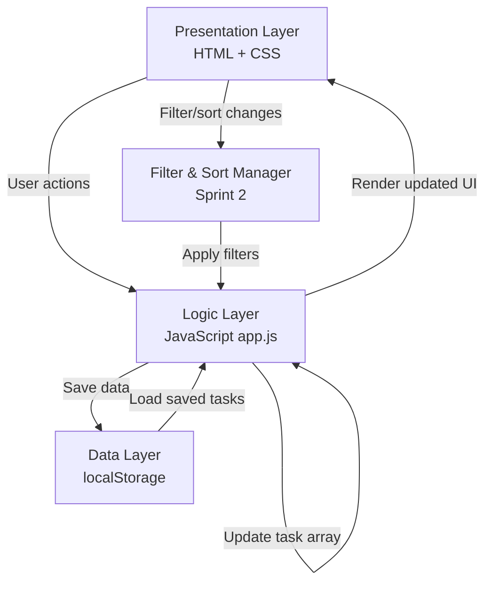
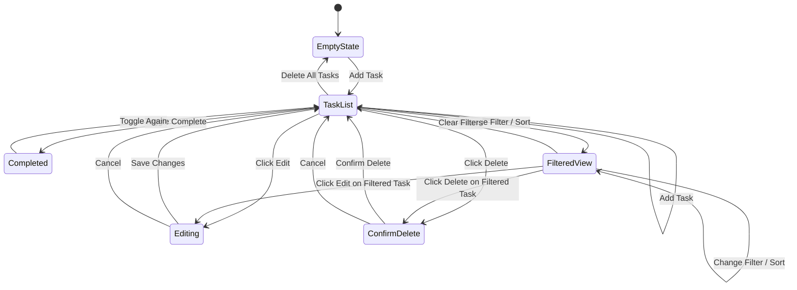
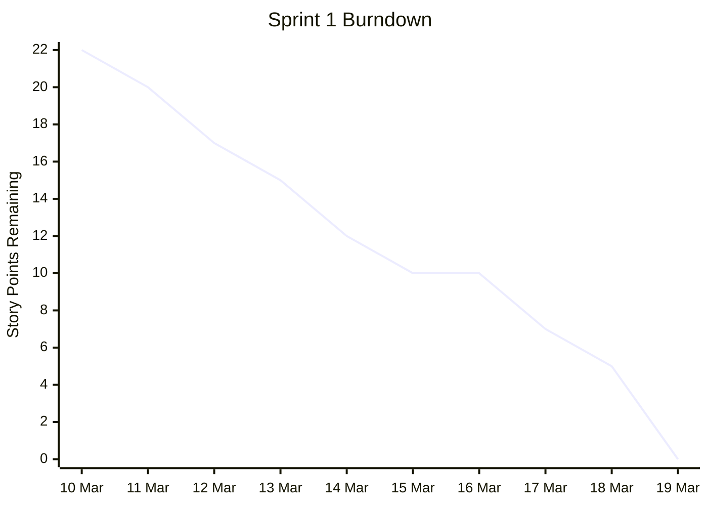
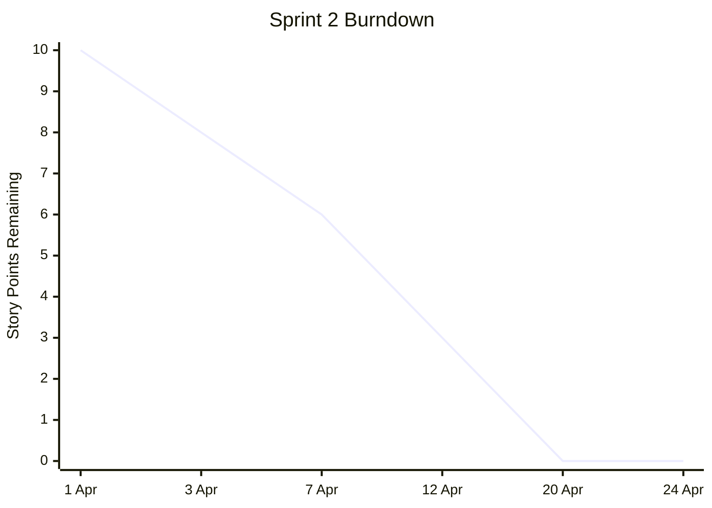

# StudyFlow2---Sprint-2

# StudyFlow - System Design Document

**A mobile-first personal task planner designed for university students**

**Student:** Shreyas Jaiswal  
**Module:** Software Development 2 (5FTC1322 / 5FTC1323)  
**Date:** April 2026 (Sprint 2 Update)

---

## Table of Contents

1. [User & System Requirements](#1-user--system-requirements)
2. [Product Backlog](#2-product-backlog)
3. [Design & Development Documentation](#3-design--development-documentation)
4. [Project Management](#4-project-management)
5. [Software Tools & Techniques](#5-software-tools--techniques)
6. [Completion & Testing](#6-completion--testing)

---

# 1. User & System Requirements

## 1.1 User Requirements (User Stories)

User stories are prioritised using the **MoSCoW method**:

- **Must Have (M)** - Essential for the app to function; without these, the product has no value.
- **Should Have (S)** - Important features that add significant value but are not critical for launch.
- **Could Have (C)** - Nice-to-have features that improve the experience but can be deferred.
- **Won't Have (W)** - Out of scope for this version but considered for future development.

### Must Have

| ID | User Story | Priority |
|----|-----------|----------|
| US-01 | As a student, I want to create a task with a title and deadline, so that I can record upcoming coursework in one place. | Must |
| US-02 | As a student, I want to assign a priority level (Low, Medium, High) to each task, so that I can focus on the most urgent work first. | Must |
| US-03 | As a student, I want to tag each task with a module name, so that I can organise my workload by subject. | Must |
| US-04 | As a student, I want to mark a task as complete, so that I can track my progress and see what I have finished. | Must |
| US-05 | As a student, I want to view all my tasks for today, so that I can see what needs my attention right now. | Must |
| US-06 | As a student, I want to edit an existing task, so that I can update details if a deadline or priority changes. | Must |
| US-07 | As a student, I want to delete a task, so that I can remove items that are no longer relevant. | Must |

### Should Have

| ID | User Story | Priority |
|----|-----------|----------|
| US-08 | As a student, I want to view my tasks for the current week, so that I can plan ahead and manage my time across multiple days. | Should |
| US-09 | As a student, I want to receive a reminder notification before a deadline, so that I do not forget about upcoming submissions. | Should |
| US-10 | As a student, I want to filter my task list by module, so that I can focus on one subject at a time when studying. | Should |
| US-11 | As a student, I want to filter my task list by priority level, so that I can quickly find my most urgent tasks. | Should |

### Could Have

| ID | User Story | Priority |
|----|-----------|----------|
| US-12 | As a student, I want to see a progress summary (e.g. tasks completed vs. remaining), so that I feel motivated and can gauge how much work is left. | Could |
| US-13 | As a student, I want to sort tasks by deadline or priority, so that I can view my workload in the order that suits me best. | Could |
| US-14 | As a student, I want my tasks to be saved when I close the browser, so that I do not lose my data between sessions. | Could |
| US-15 | As a student, I want a colour-coded visual indicator for priority levels, so that I can scan my task list quickly at a glance. | Could |

### Won't Have (This Version)

| ID | User Story | Priority |
|----|-----------|----------|
| US-16 | As a student, I want to sync my tasks across multiple devices, so that I can access them from my phone and laptop. | Won't |
| US-17 | As a student, I want to share tasks or deadlines with classmates, so that we can coordinate on group work. | Won't |
| US-18 | As a student, I want to import deadlines from my university timetable automatically, so that I do not have to enter them manually. | Won't |

---

## 1.2 System Requirements

System requirements define what the application must do technically to support the user stories above.

### Functional System Requirements

| ID | Requirement | Related User Stories |
|----|------------|---------------------|
| SR-01 | The system shall allow the user to create, read, update, and delete (CRUD) tasks. Each task must store: title (text), deadline (date), priority level (Low/Medium/High), module name (text), and completion status (boolean). | US-01, US-02, US-03, US-04, US-06, US-07 |
| SR-02 | The system shall display tasks in a daily view, showing only tasks with deadlines matching the current date. | US-05 |
| SR-03 | The system shall display tasks in a weekly view, showing tasks with deadlines falling within the current Monday-Sunday period. | US-08 |
| SR-04 | The system shall allow the user to filter tasks by module name and/or priority level. | US-10, US-11 |
| SR-05 | The system shall provide visual distinction between priority levels using colour coding (e.g. green for Low, amber for Medium, red for High). | US-15 |
| SR-06 | The system shall trigger a browser notification or on-screen alert before a task's deadline (e.g. 24 hours or 1 hour before). | US-09 |
| SR-07 | The system shall persist task data using browser localStorage, so that data is retained between sessions without requiring a backend server. | US-14 |
| SR-08 | The system shall display a progress summary showing the number of tasks completed and tasks remaining. | US-12 |

### Non-Functional System Requirements

| ID | Requirement | Category |
|----|------------|----------|
| NFR-01 | The application shall be built using HTML, CSS, and JavaScript with no backend server required. | Technology |
| NFR-02 | The application shall be responsive and optimised for mobile screen sizes (360px-428px width) as the primary viewport, while remaining usable on desktop. | Usability |
| NFR-03 | The application shall load within 3 seconds on a standard mobile connection. | Performance |
| NFR-04 | The user interface shall follow a minimalist design with a calm colour palette (blues and neutrals) to reduce cognitive load. | Usability |
| NFR-05 | The application shall use clear, legible typography with a minimum font size of 16px for body text to ensure readability on small screens. | Accessibility |
| NFR-06 | All interactive elements (buttons, inputs) shall have a minimum tap target size of 44x44px to meet mobile accessibility standards. | Accessibility |
| NFR-07 | The system shall validate user input (e.g. prevent empty task titles, ensure deadlines are not in the past) and display clear error messages. | Robustness |
| NFR-08 | The codebase shall be modular, with separate files or clearly separated sections for HTML structure, CSS styling, and JavaScript logic. | Maintainability |

---

# 2. Product Backlog

## Sprint Overview

| Sprint | Duration | Focus | Goal |
|--------|----------|-------|------|
| Sprint 1 | 10-20 Mar 2026 | Core functionality | Deliver a fully working task manager with CRUD operations, priority levels, module tagging, completion tracking, and mobile-first responsive design. |
| **Sprint 2** | **1-25 Apr 2026** | **Enhanced filtering & UX** | **Extend the prototype with view filters (today/week), module and priority filtering, progress summary, and task sorting. All Sprint 1 functionality remains intact.** |

**Estimation Scale (Story Points):**

- 1 = Trivial (under 1 hour)
- 2 = Small (1-2 hours)
- 3 = Medium (2-4 hours)
- 5 = Large (4-8 hours)
- 8 = Complex (8+ hours)

---

## Definition of Done

A backlog item is considered **Done** when all of the following are true:

| Criterion | Detail |
|-----------|--------|
| All acceptance criteria met | Every checkbox in the backlog item is ticked and verified manually |
| Code committed to GitHub | Changes pushed to the main branch with a descriptive commit message |
| No console errors | Browser DevTools console shows no errors on page load or during interaction |
| Responsive check passed | Feature works correctly at both 375px (mobile) and 1024px (desktop) viewport widths |
| localStorage verified | Any data changes are persisted correctly and survive a page refresh |
| Peer review done | Code read through once before marking complete to catch obvious issues |

---

## Sprint 1 - Core Functionality (Completed)

### BL-01: Project setup and HTML structure

- **Related Stories:** NFR-01, NFR-08
- **Description:** Set up the project folder structure with separate HTML, CSS, and JS files. Create the base HTML page with semantic structure including a header, main content area, task list container, and a form area for adding tasks.
- **Acceptance Criteria:**
  - [x] Project contains `index.html`, `style.css`, and `app.js` as separate files
  - [x] HTML uses semantic elements (`header`, `main`, `section`, `form`)
  - [x] Page loads in a browser without errors
  - [x] Basic layout structure is visible (header, content area, empty task list)
- **Story Points:** 2 - **COMPLETE**

---

### BL-02: Task creation form

- **Related Stories:** US-01, US-02, US-03, SR-01
- **Description:** Build a form that allows the user to create a new task by entering a title, selecting a deadline, choosing a priority level, and entering a module name.
- **Acceptance Criteria:**
  - [x] Form includes fields for: title, deadline, priority (Low/Medium/High dropdown), and module name
  - [x] Clicking **Add Task** creates a new task and displays it in the task list
  - [x] The form clears after successful submission
  - [x] Each task is stored as a JavaScript object with properties: `id`, `title`, `deadline`, `priority`, `module`, `completed`
- **Story Points:** 3 - **COMPLETE**

---

### BL-03: Input validation

- **Related Stories:** NFR-07
- **Description:** Add validation to the task creation form to prevent invalid or incomplete data from being submitted.
- **Acceptance Criteria:**
  - [x] The form does not submit if the title field is empty
  - [x] The form does not submit if no deadline is selected
  - [x] The form does not accept a deadline date in the past
  - [x] An error message is displayed next to the relevant field when validation fails
  - [x] Error messages disappear once the user corrects the input
- **Story Points:** 2 - **COMPLETE**

---

### BL-04: Task list display

- **Related Stories:** US-05, SR-02, SR-05
- **Description:** Display all tasks in a card layout. Each card shows the title, deadline, module name, and priority level with colour coding.
- **Acceptance Criteria:**
  - [x] All tasks currently in the array are rendered on the page
  - [x] Each task card displays: title, deadline (formatted), module name, and priority level
  - [x] Priority levels are colour-coded: green (Low), amber (Medium), red (High)
  - [x] Completed tasks are visually distinct (strikethrough + faded appearance)
  - [x] The task list updates immediately when a new task is added
- **Story Points:** 3 - **COMPLETE**

---

### BL-05: Mark task as complete

- **Related Stories:** US-04, SR-01
- **Description:** Add a checkbox to each task card that allows the user to toggle the task's completion status.
- **Acceptance Criteria:**
  - [x] Each task has a clickable checkbox
  - [x] Clicking the checkbox toggles the task's completed status
  - [x] Completed tasks show a visual change (strikethrough, greyed out)
  - [x] The user can un-complete a task by clicking the checkbox again
- **Story Points:** 2 - **COMPLETE**

---

### BL-06: Edit task

- **Related Stories:** US-06, SR-01
- **Description:** Allow the user to edit an existing task's details using the same form, pre-filled with current values.
- **Acceptance Criteria:**
  - [x] Each task has an **Edit** button
  - [x] Clicking **Edit** opens the task's details in the form pre-filled with current values
  - [x] The user can change any field and save
  - [x] The updated task is immediately reflected in the task list
  - [x] Cancelling an edit does not change the task
- **Story Points:** 3 - **COMPLETE**

---

### BL-07: Delete task

- **Related Stories:** US-07, SR-01
- **Description:** Allow the user to delete a task from the list with a confirmation step.
- **Acceptance Criteria:**
  - [x] Each task has a **Delete** button
  - [x] Clicking **Delete** shows a confirmation prompt
  - [x] Confirming the prompt removes the task from the list
  - [x] The task list re-renders immediately after deletion
  - [x] Cancelling the prompt keeps the task unchanged
- **Story Points:** 2 - **COMPLETE**

---

### BL-08: Mobile-first responsive CSS

- **Related Stories:** NFR-02, NFR-04, NFR-05, NFR-06
- **Description:** Style the application with a mobile-first approach using a calm blue/neutral palette, with media queries for larger screens.
- **Acceptance Criteria:**
  - [x] The layout is designed for mobile viewports (360-428px) first
  - [x] Body text is a minimum of 16px
  - [x] All buttons and interactive elements have a minimum tap target of 44x44px
  - [x] Colour palette uses blues and neutrals
  - [x] A media query adjusts the layout for desktop screens (768px+)
  - [x] No horizontal scrolling on mobile viewports
- **Story Points:** 5 - **COMPLETE**

**Sprint 1 Total: 22 story points - ALL COMPLETE**

---

## [S2] Sprint 2 - Enhanced Filtering & UX (NEW)

> **Sprint 2 additions are highlighted throughout this document. New backlog items, development entries, meeting notes, and test cases all begin with `[S2]` to distinguish Sprint 2 content from Sprint 1.**

### [S2] BL-09: Daily and weekly view filter

- **Related Stories:** US-05, US-08, SR-02, SR-03
- **Description:** Add a filter bar above the task list allowing the user to toggle between three views: **All** (show all tasks), **Today** (show only tasks with a deadline matching today's date), and **This Week** (show tasks due within the current Monday-Sunday period). The filter bar is always visible and the active view is highlighted.
- **Acceptance Criteria:**
  - [x] A filter bar is displayed above the task list with three options: **All**, **Today**, **This Week**
  - [x] Selecting **Today** shows only tasks with `deadline === todayString`
  - [x] Selecting **This Week** shows only tasks with deadlines falling within the current calendar week (Mon-Sun)
  - [x] Selecting **All** removes the view filter and shows all tasks
  - [x] The active filter is visually highlighted
  - [x] The task count badge updates to reflect the filtered result
  - [x] The empty state message updates to indicate no tasks match the current filter (e.g. *No tasks due today*)
- **Story Points:** 3 - **COMPLETE (Sprint 2)**

---

### [S2] BL-11: Filter by module and priority

- **Related Stories:** US-10, US-11, SR-04
- **Description:** Add module and priority filter controls to the filter bar. The module filter is a text search that matches task module names. The priority filter is a set of toggle buttons (All, High, Medium, Low). Filters stack with the view filter (BL-09), e.g. a user can show only High priority tasks due this week.
- **Acceptance Criteria:**
  - [x] A priority filter is displayed with options: **All**, **High**, **Medium**, **Low**
  - [x] Selecting a priority shows only tasks with that priority level; selecting **All** removes the priority filter
  - [x] A module search input filters tasks whose module field contains the entered text (case-insensitive)
  - [x] All filters (view, priority, module) work in combination
  - [x] A **Clear Filters** button resets all filters to their default state
  - [x] The active priority filter button is visually highlighted
- **Story Points:** 3 - **COMPLETE (Sprint 2)**

---

### [S2] BL-12: Sort tasks by deadline or priority

- **Related Stories:** US-13
- **Description:** Formalise the task sorting behaviour. Tasks are sorted automatically: incomplete tasks appear above completed ones. Within incomplete tasks, overdue tasks appear first (most urgent), then by deadline ascending. Priority is used as a secondary sort within the same deadline. A sort control allows the user to switch between **Deadline** and **Priority** sort order.
- **Acceptance Criteria:**
  - [x] Completed tasks are always sorted to the bottom of the list
  - [x] Overdue tasks appear at the top of the incomplete section
  - [x] Within incomplete tasks, a **Sort by** control allows switching between deadline order and priority order
  - [x] Priority order is: High -> Medium -> Low
  - [x] The selected sort order is visually indicated
  - [x] Sorting persists across filter changes within a session
- **Story Points:** 2 - **COMPLETE (Sprint 2)**

---

### [S2] BL-15: Progress summary

- **Related Stories:** US-12, SR-08
- **Description:** Display a real-time progress summary in the header showing total tasks, active tasks, completed tasks, and a percentage progress bar. The progress bar animates when updated and glows when 100% is reached.
- **Acceptance Criteria:**
  - [x] Header displays: **Total**, **Active**, and **Done** counts
  - [x] A progress bar shows the percentage of tasks completed
  - [x] The bar width animates smoothly when tasks are added, completed, or deleted
  - [x] When all tasks are complete, the bar glows green and the label reads *All tasks completed!*
  - [x] When no tasks exist, the label reads *No tasks yet*
  - [x] Stats update immediately on any task change
- **Story Points:** 2 - **COMPLETE (Sprint 2)**

**Sprint 2 Total: 10 story points - ALL COMPLETE**

---

## Remaining Future Backlog

The following items were not implemented in Sprint 1 or Sprint 2. They remain documented for future development cycles.

| ID | Feature | Related Stories | Story Points | Rationale for Deferral |
|----|---------|----------------|-------------|----------------------|
| BL-10 | Extended weekly view (Mon-Sun grid layout) | US-08, SR-03 | 3 | The This Week filter (BL-09) addresses the core use case; a calendar grid layout adds complexity without core value |
| BL-13 | localStorage persistence | US-14, SR-07 | 3 | **Completed during Sprint 1** (implemented within BL-02) |
| BL-14 | Reminder notifications | US-09, SR-06 | 5 | Technically complex (browser Notification API requires HTTPS and user permission); deferred |

---

# 3. Design & Development Documentation

## 3.1 Overall Design & Architecture

StudyFlow follows a **three-layer architecture** that separates concerns between presentation, logic, and data.

### Presentation Layer (HTML / CSS)

Handles the user interface. A single HTML page (`index.html`) is styled by an external stylesheet (`style.css`). The page is divided into three main areas:

- Header with progress stats
- Task form section
- Task list section

Sprint 2 adds a filter bar between the form section and the task list.

### Logic Layer (JavaScript)

All application behaviour is handled by a single JavaScript file (`app.js`). This layer contains five logical modules:

- **Task Manager** - handles all CRUD operations on the task array
- **Validation** - checks user input before a task is created or updated
- **Renderer** - updates the DOM whenever task data or filter state changes
- **Utilities** - helper functions for date formatting, ID generation, and overdue detection
- **[S2] Filter & Sort Manager** - manages the active view filter, priority filter, module search, and sort order; applies all active filters before passing tasks to the renderer

### Data Layer (Browser localStorage)

Tasks are stored as a JSON array in `localStorage`.

Filter state is not persisted. It resets on page load. This is an intentional design decision because each session should begin with the full task list, avoiding confusion from old filters still being active.

### File Structure

```text
StudyFlow/
|-- index.html      - Page structure and content (updated Sprint 2)
|-- style.css       - All styling and responsive design (updated Sprint 2)
|-- app.js          - Application logic and behaviour (updated Sprint 2)
|-- README.md       - Project documentation (this file)
```

### Data Flow

1. The user interacts with the UI, such as clicking **Add Task** or changing a filter.
2. A DOM event triggers a JavaScript function in the logic layer.
3. For task changes, the function validates input and updates the task array.
4. The updated task array is saved to `localStorage`.
5. For filter changes, the `filterState` object is updated.
6. The renderer applies active filters and sort order.
7. The filtered and sorted task list is re-drawn on the page.

### Architecture Diagram



### Architecture Evaluation

Sprint 2 improves the architecture by separating **task data** from **view state**.

| Concern | Stored In | Purpose |
|--------|-----------|---------|
| Task data | `tasks` array + `localStorage` | Permanent user-created task records |
| View state | `filterState` object | Temporary UI filtering and sorting choices |
| Rendered output | DOM | Current visible result after filtering and sorting |

This separation is important because filters should not modify the original task data. They only transform how the data is displayed. This reduces the risk of accidental data loss and makes the filtering logic easier to test.

---

## 3.2 Development Strategy

StudyFlow is developed using an **iterative, sprint-based approach**. Sprint 1 delivered the core CRUD functionality. Sprint 2 extends the prototype with filtering, sorting, and progress tracking without modifying or breaking any Sprint 1 functionality.

### Sprint 2 Development Order

1. **Progress summary (BL-15)** - implemented first because the header stats and progress bar structure already existed in the HTML from Sprint 1; this only required completing the JavaScript `updateStats()` function.
2. **Sort control (BL-12)** - formalised the sort logic already in the renderer and added a sort toggle UI above the task list.
3. **View filter (BL-09)** - added the filter bar with All / Today / This Week buttons; introduced the `filterState` object to the logic layer.
4. **Module and priority filter (BL-11)** - extended `filterState` to include priority and module search; all three filters are applied together in a single `getFilteredTasks()` function before rendering.

This order minimised risk. Each feature was added and tested before the next began. The filter state approach was chosen over multiple separate filter functions to keep the renderer simple. The renderer always calls `getFilteredTasks()` regardless of what changed.

### [S2] Sprint 2 Highlighted Code Changes

All Sprint 2 additions to the codebase are marked with a `// [SPRINT 2]` comment in `app.js` and a corresponding CSS block label in `style.css` for traceability.

**New in `index.html` (Sprint 2):**

- Filter bar section added above the task list
- View toggle buttons: **All**, **Today**, **This Week**
- Priority filter buttons: **All**, **High**, **Medium**, **Low**
- Module search input
- **Clear Filters** button
- Sort control inside the task section header

**New in `app.js` (Sprint 2):**

- `filterState` object - stores active view (`all` / `today` / `week`), active priority (`all` / `High` / `Medium` / `Low`), and module search text
- `getWeekRange()` - calculates the Monday and Sunday of the current week for the This Week filter
- `getFilteredTasks()` - applies all active filters sequentially to the tasks array
- `sortTasks()` - sorts filtered tasks by the active sort mode (deadline or priority)
- `updateFilterUI()` - syncs the active visual state of filter buttons with the current filter state
- `setupFilterListeners()` - attaches all event listeners for the filter bar controls
- Extended `renderTasks()` to call `getFilteredTasks()` and `sortTasks()` before rendering

**New in `style.css` (Sprint 2):**

- `.filter-bar` - container for all filter controls
- `.filter-group` - label and control row layout
- `.filter-btn` - individual filter toggle button
- `.filter-btn--active` - highlighted state for the active filter
- `.filter-input` - module search input styling
- `.sort-control` - sort selector above the task list

### Development Strategy Evaluation

| Strength | Explanation |
|---------|-------------|
| Low-risk iteration | Each feature was completed and tested before the next was started. |
| Clear traceability | Each change maps to a backlog item and acceptance criteria. |
| Maintainability | Sprint 2 functionality was added through new filter/sort functions rather than rewriting the full renderer. |
| Controlled scope | Notification features were deferred because browser permissions and HTTPS requirements would introduce complexity beyond the sprint scope. |

---

## 3.3 Technology Stack

### Core Technologies

| Technology | Role | Justification |
|-----------|------|---------------|
| HTML5 | Page structure | Semantic elements improve accessibility. Native form elements reduce the need for custom components. |
| CSS3 | Styling & layout | Flexbox and media queries enable a responsive, mobile-first layout without any CSS frameworks. |
| JavaScript (ES6+) | Application logic | Handles all interactivity, data management, DOM manipulation, filtering, and sorting. No framework is needed for this scope. |
| Browser localStorage | Data persistence | Stores tasks as a JSON string between sessions. Suitable for a single-user, client-side application. |

### Why No Framework?

A framework like React or Vue would add unnecessary complexity for an application of this size. Vanilla JavaScript provides full control over the DOM without the overhead of a build system or framework-specific syntax. This also means the app can be opened directly in a browser from the file system with no server or build step required.

### Technology Trade-Offs

| Decision | Benefit | Limitation |
|---------|---------|------------|
| Vanilla JavaScript | Lightweight, transparent, no dependencies | More manual DOM handling |
| localStorage | Simple persistence, no backend required | Data is tied to one browser/device |
| Single-page app | Fast, simple user flow | Limited scalability for multi-user features |
| Manual testing | Easy to conduct and document | Less reliable than automated regression tests |

---

## 3.4 User Interface Design

### Design Principles

1. **Minimalist layout** - reduce cognitive load by showing only essential information.
2. **Calm colour palette** - blues and neutral tones; high-contrast colours reserved for priority indicators.
3. **Clear typography** - minimum font size of 16px for body text.
4. **Accessible touch targets** - all buttons and interactive elements have a minimum size of 44x44px.

### [S2] Sprint 2 UI Additions

**Filter Bar** - positioned between the form section and the task list. It contains:

- **View** toggle row: `All | Today | This Week`
- **Priority** filter row: `All | High | Medium | Low`
- **Module** text search input
- **Clear Filters** button

**Sort Control** - a compact `Sort by: Deadline | Priority` control inside the task section header. This allows the user to change task ordering without affecting the active filters.

The filter bar uses the same design tokens as the rest of the app:

- Colour variables
- Border radius
- Font size
- Button spacing
- Active state styling

### Colour Palette

| Colour | Hex Code | Usage |
|--------|----------|-------|
| Dark Blue | `#1A3A5C` | Header background, primary buttons |
| Medium Blue | `#2E6B9E` | Active states, links, active filter buttons |
| Light Blue | `#E8F0FE` | Card backgrounds, subtle highlights |
| White | `#FFFFFF` | Page background |
| Light Grey | `#F0F2F5` | Section backgrounds |
| Dark Grey | `#333333` | Body text |
| Red | `#D9534F` | High priority indicator |
| Amber | `#F0AD4E` | Medium priority indicator |
| Green | `#5CB85C` | Low priority indicator, completed tasks |

### Responsive Design Approach

- Base styles target mobile screens (360-428px width)
- Media query at 768px switches to a two-column grid layout
- Sprint 2 filter controls use wrapping/scroll-safe layouts to avoid breaking on narrow mobile screens
- Buttons retain at least 44x44px tap targets

### UI Design Evaluation

| Design Decision | Benefit | Trade-Off |
|----------------|---------|-----------|
| Inline task form | Simple and mobile-friendly | Takes vertical space on small screens |
| Filter bar above task list | Easy to find and use | Adds visual density |
| Module text search | Flexible and quick | Users can type inconsistent module names |
| Priority buttons | Faster than dropdown interaction | Takes more horizontal space |
| Progress bar in header | Immediate feedback | Could distract if over-animated |

---

## 3.5 State Diagram

### [S2] Updated Application States (Sprint 2)

The Sprint 2 filter state is separate from the task interaction states. The user can change filters at any time regardless of whether they are in Add or Edit mode.



### State Diagram Evaluation

The diagram shows that filtering is a **view transformation**, not a destructive data operation. This means:

- The task array remains unchanged.
- Only the visible task list changes.
- Edit and delete still work on filtered tasks because every task keeps its unique ID.

---

## 3.6 Technical Challenges

| Challenge | Description | Solution |
|-----------|-------------|----------|
| Unique task IDs | Each task needs a unique identifier for edit and delete operations. | Generate a unique ID using `Date.now().toString(36)` combined with a random suffix. |
| Date handling | JavaScript Date objects can behave inconsistently across browsers and time zones. | Store deadlines as `YYYY-MM-DD` strings and compare as strings for filtering, avoiding time zone issues. |
| Form reuse for add and edit | The same form is used for creating and editing tasks. | Use a flag variable (`editingTaskId = null`). Null = create; an ID value = update. Reset after each submission. |
| [S2] Stacking multiple filters | Applying view, priority, and module filters simultaneously without losing track of which filters are active. | A single `filterState` object holds all active filter values. `getFilteredTasks()` applies them sequentially in one pass, keeping the logic readable and testable. |
| [S2] Empty state with filters active | When filters return no results, the empty state message should explain why rather than showing a generic message. | The renderer passes the active filter context to the empty state renderer, which selects an appropriate message string. |
| [S2] Week boundary calculation | Determining the start (Monday) and end (Sunday) of the current week reliably, including month/year boundaries. | `getWeekRange()` calculates Monday by subtracting `(dayOfWeek + 6) % 7` days from today, then adds 6 for Sunday, using `YYYY-MM-DD` string comparisons. |

### Code Evidence

**Challenge: Form reuse for add and edit (editingTaskId flag pattern)**

```javascript
let editingTaskId = null;

function handleSubmit(e) {
  e.preventDefault();
  const title = document.getElementById('task-title').value.trim();
  const deadline = document.getElementById('task-deadline').value;
  const priority = document.getElementById('task-priority').value;
  const module = document.getElementById('task-module').value.trim();

  if (!validateForm(title, deadline)) return;

  if (editingTaskId) {
    updateTask(editingTaskId, title, deadline, priority, module);
    cancelEditing();
  } else {
    addTask(title, deadline, priority, module);
    document.getElementById('task-form').reset();
  }
  renderTasks();
}
```

The single flag eliminates the need for two separate forms or conditional form rendering. The same HTML inputs serve both purposes with no duplication.

---

**Challenge: Week boundary calculation (Monday-start week)**

```javascript
function getWeekRange() {
  const today = new Date(getTodayString() + 'T00:00:00');
  const dayOfWeek = today.getDay();
  const daysFromMonday = (dayOfWeek + 6) % 7;

  const monday = new Date(today);
  monday.setDate(today.getDate() - daysFromMonday);

  const sunday = new Date(monday);
  sunday.setDate(monday.getDate() + 6);

  return { start: toYMD(monday), end: toYMD(sunday) };
}
```

Using `(dayOfWeek + 6) % 7` correctly maps JavaScript's Sunday-zero convention to a Monday-zero index without any conditional branching.

---

**Challenge: [S2] Stacking multiple filters (filterState pipeline)**

```javascript
let filterState = {
  view: 'all',
  priority: 'all',
  module: ''
};

function getFilteredTasks() {
  let result = [...tasks];
  const today = getTodayString();

  if (filterState.view === 'today') {
    result = result.filter(t => t.deadline === today);
  } else if (filterState.view === 'week') {
    const { start, end } = getWeekRange();
    result = result.filter(t => t.deadline >= start && t.deadline <= end);
  }

  if (filterState.priority !== 'all') {
    result = result.filter(t => t.priority === filterState.priority);
  }

  const q = filterState.module.trim().toLowerCase();
  if (q !== '') {
    result = result.filter(t => t.module.toLowerCase().includes(q));
  }

  return result;
}
```

Each filter reduces the result set sequentially. The renderer always calls `getFilteredTasks()` regardless of which filter changed, so there is no duplication of render logic across event handlers.

### Technical Evaluation

The most important Sprint 2 technical improvement is the **filter pipeline**:

```text
Original tasks array
        v
View filter (All / Today / This Week)
        v
Priority filter
        v
Module search filter
        v
Sort order
        v
Rendered task cards
```

This pipeline is maintainable because each transformation has a clear purpose. It also supports future expansion, such as adding a completed/incomplete filter or module dropdown.

---

## 3.7 Test Plan

Testing is conducted manually by working through each backlog item's acceptance criteria. Each criterion is treated as an individual test case.

### Test Log Structure

| Column | Description |
|--------|-------------|
| Test ID | Unique identifier |
| Related Backlog Item | Which BL item is being tested |
| Test Description | What is being tested |
| Steps to Reproduce | Exact steps to perform the test |
| Expected Result | What should happen |
| Actual Result | What actually happened |
| Status | Pass / Fail |
| Notes | Observations, bugs found, or fixes applied |

---

### Sprint 1 Test Cases

#### BL-01: Project Setup

| Test ID | Test Description | Steps | Expected Result |
|---------|------------------|-------|-----------------|
| T-01 | Project files load without errors | Open index.html in Chrome. Check DevTools console. | Page loads with no console errors. Header, form, and task list sections are visible. |
| T-02 | Semantic HTML structure present | View page source. Check for header, main, section, form elements. | All semantic elements are present and correctly nested. |

#### BL-02: Task Creation Form

| Test ID | Test Description | Steps | Expected Result |
|---------|------------------|-------|-----------------|
| T-03 | Task is created with all fields | Fill in title, deadline, priority, module. Click Add Task. | Task card appears immediately with all entered values correct. |
| T-04 | Form clears after submission | Submit a valid task. Check form fields. | All fields reset to defaults after successful submission. |
| T-05 | Task object structure is correct | Add a task. Check localStorage in DevTools Application tab. | Task stored as object with id, title, deadline, priority, module, completed (false). |

#### BL-03: Input Validation

| Test ID | Test Description | Steps | Expected Result |
|---------|------------------|-------|-----------------|
| T-06 | Empty title is rejected | Leave title blank. Click Add Task. | Form does not submit. Error shown below title field. |
| T-07 | Missing deadline is rejected | Leave deadline blank. Click Add Task. | Form does not submit. Error shown below deadline field. |
| T-08 | Past deadline is rejected | Enter yesterday's date. Click Add Task. | Form does not submit. Error shows deadline cannot be in the past. |
| T-09 | Error clears on correction | Trigger a title error. Start typing in title field. | Error message disappears as soon as input begins. |

#### BL-04: Task List Display

| Test ID | Test Description | Steps | Expected Result |
|---------|------------------|-------|-----------------|
| T-10 | Task card shows all fields | Add a task with all fields filled. Inspect card. | Card shows title, formatted deadline, priority badge, and module badge. |
| T-11 | Priority colour coding is correct | Add tasks with Low, Medium, High priority. | Low = green border/badge, Medium = amber, High = red. |
| T-12 | Task list updates immediately | Add a task. | New card appears without page refresh. |

#### BL-05: Mark Task as Complete

| Test ID | Test Description | Steps | Expected Result |
|---------|------------------|-------|-----------------|
| T-13 | Checkbox marks task complete | Click the checkbox on a task. | Task fades, title gets strikethrough, completed = true in localStorage. |
| T-14 | Checkbox toggles back to incomplete | Click a completed task's checkbox again. | Full opacity restored, strikethrough removed, completed = false. |

#### BL-06: Edit Task

| Test ID | Test Description | Steps | Expected Result |
|---------|------------------|-------|-----------------|
| T-15 | Edit populates form with current values | Click Edit on a task. | Form fills with current title, deadline, priority, module. Heading changes to Edit Task. Cancel button appears. |
| T-16 | Saving edit updates the card | Change a field and click Save Changes. | Card reflects updated values immediately. |
| T-17 | Cancel edit leaves task unchanged | Click Edit, change a field, click Cancel. | Task shows original values. Form resets to Add New Task mode. |

#### BL-07: Delete Task

| Test ID | Test Description | Steps | Expected Result |
|---------|------------------|-------|-----------------|
| T-18 | Delete shows confirmation prompt | Click Delete on a task. | Browser confirm dialog appears with task title in the message. |
| T-19 | Confirming delete removes task | Click Delete then OK. | Task removed from list immediately. |
| T-20 | Cancelling delete keeps task | Click Delete then Cancel. | Task remains unchanged. |

#### BL-08: Mobile-First Responsive CSS

| Test ID | Test Description | Steps | Expected Result |
|---------|------------------|-------|-----------------|
| T-21 | Single column layout at 375px | Open DevTools, set viewport to 375px. | Single column, no horizontal scrolling, all text readable at 16px minimum. |
| T-22 | Two column layout at 1024px | Set DevTools viewport to 1024px. | Form sticky on left, task list on right in two-column grid. |
| T-23 | Tap targets meet 44px minimum | Inspect Add Task, Edit, Delete buttons in DevTools. | All buttons report min-height 44px or greater. |
| T-24 | Colour palette matches design | Check header and task cards visually. | Header is dark blue (#1A3A5C). Cards white with priority-coloured left border. Badges match palette. |

**Sprint 1 Test Total: 24 test cases**

---

### [S2] Sprint 2 Test Cases

#### BL-09: Daily and Weekly View Filter

| Test ID | Test Description | Steps | Expected Result |
|---------|------------------|-------|-----------------|
| T-25 | Today filter shows only today's tasks | Add a task with today's deadline and one with a future deadline. Click **Today**. | Only the task due today is visible. Task count badge updates. |
| T-26 | This Week filter shows tasks in current week | Add tasks for today, a day this week, and next month. Click **This Week**. | Only tasks within the current Mon-Sun window are shown. |
| T-27 | All filter restores full list | Apply Today filter, then click **All**. | All tasks are visible again. |
| T-28 | Empty state message reflects active filter | Apply Today filter with no tasks due today. | Empty state shows *No tasks due today* rather than the default message. |
| T-29 | Active filter button is highlighted | Click **This Week**. | This Week button is visually highlighted. All and Today buttons are not. |

#### BL-11: Filter by Module and Priority

| Test ID | Test Description | Steps | Expected Result |
|---------|------------------|-------|-----------------|
| T-30 | Priority filter shows correct tasks | Create tasks with High, Medium, Low priority. Click **High**. | Only High priority tasks are shown. |
| T-31 | Module search filters by text | Create tasks with modules Networking and Mathematics. Type net in the module search. | Only the Networking task is shown (case-insensitive match). |
| T-32 | Combined filters stack correctly | Apply This Week view filter and High priority filter. | Only High priority tasks due this week are shown. |
| T-33 | Clear Filters resets all filters | Apply multiple filters. Click **Clear Filters**. | All filters reset; full task list is shown; all filter buttons return to unselected state. |
| T-34 | Module search clears on Clear Filters | Type in module search field. Click **Clear Filters**. | Module search input is cleared and all tasks are visible. |

#### BL-12: Sort by Deadline or Priority

| Test ID | Test Description | Steps | Expected Result |
|---------|------------------|-------|-----------------|
| T-35 | Default sort is by deadline | Add tasks with different deadlines. Check task order. | Tasks sorted by nearest deadline first; overdue tasks at top; completed tasks at bottom. |
| T-36 | Priority sort orders High -> Medium -> Low | Switch sort to **Priority**. | High priority tasks appear first, then Medium, then Low. Within same priority, deadline order is maintained. |
| T-37 | Sort persists across filter changes | Set sort to Priority. Apply a filter. | Sort order remains Priority after applying the filter. |

#### BL-15: Progress Summary

| Test ID | Test Description | Steps | Expected Result |
|---------|------------------|-------|-----------------|
| T-38 | Stats update when task is added | Add a task. | Total and Active counts each increase by 1. |
| T-39 | Stats update when task is completed | Mark a task as complete. | Done count increases; Active count decreases; progress bar updates. |
| T-40 | Progress bar shows correct percentage | Add 4 tasks, complete 2. | Progress bar shows 50%, label reads 50% complete (2/4). |
| T-41 | All tasks complete triggers glow | Complete all tasks. | Progress bar fills to 100% and glows. Label reads All tasks completed!. |
| T-42 | Empty state shows No tasks yet | Delete all tasks. | Stats show 0/0/0, progress bar is empty, label reads No tasks yet. |

**Sprint 2 Test Total: 18 test cases**

---

# 4. Project Management

## 4.1 Sprint Review Meetings

### Review 1 - Sprint Planning (Date: 10 March 2026)

**What was done since the last meeting:**

- Completed the project pitch (Assignment 1) and received feedback
- Drafted the full System Design Document including user stories, backlog, architecture, UI design, state diagram, and test plan
- Set up the GitHub repository with initial commits

**What is planned for this session:**

- Set up project file structure (`index.html`, `style.css`, `app.js`)
- Build the task creation form with all required fields
- Begin implementing input validation

**Current problems and barriers:**

- Decided on inline form over modal for task creation - simpler on mobile
- Resolved unique ID generation using `Date.now()` plus a random string

---

### Review 2 - Mid-Sprint Check (Date: 14 March 2026)

**What was done since the last meeting:**

- Completed BL-01: project setup with semantic HTML structure
- Completed BL-02: task creation form with all four fields
- Completed BL-03: input validation for empty title, missing deadline, and past deadline
- Completed BL-04: task list display with colour-coded priority badges
- Started BL-05: mark task as complete

**What is planned for this session:**

- Finish BL-05 (completion toggle)
- Build BL-06 (edit task)
- Build BL-07 (delete task with confirmation)

**Current problems and barriers:**

- Date comparison time zone issue - fixed by storing and comparing dates as `YYYY-MM-DD` strings
- Task list was not updating immediately - fixed by reordering function calls so render occurs after array update
- CSS for priority card borders took longer than expected on mobile

---

### Review 3 - Sprint 1 Review & Retrospective (Date: 19 March 2026)

**What was done since the last meeting:**

- Completed BL-05, BL-06, BL-07, and BL-08
- Added localStorage persistence (moved from future backlog)
- Ran all 24 Sprint 1 test cases - all passed

**What is planned for this session:**

- Final bug fixes
- Prepare for the 10-minute project demo

**Current problems and barriers:**

- Edit form not scrolling into view on mobile - fixed with `scrollIntoView({ behavior: "smooth" })`
- Form accepted whitespace-only titles - fixed with `.trim()` in validation
- Completed task sorting was inconsistent - fixed with explicit sort function

**Retrospective:**

- Iterative feature-by-feature development worked well because the app remained in a working state throughout the sprint.
- Writing acceptance criteria before coding gave a clear target for testing.
- Mobile-first CSS was efficient because the desktop media query was mostly layout adjustment.
- In future, CSS should start earlier because some HTML needed small changes once the final layout evolved.
- The `editingTaskId` flag approach for form reuse was effective but required careful handling of cancel/reset behaviour.

---

### [S2] Review 4 - Sprint 2 Planning (Date: 1 April 2026)

**What was done since the last meeting:**

- Sprint 1 demo completed and submitted
- Reviewed Sprint 1 retrospective feedback
- Selected Sprint 2 backlog items based on user value and achievability: BL-09, BL-11, BL-12, BL-15

**What is planned for this session:**

- Implement progress summary (BL-15)
- Formalise the sort logic and add a sort control (BL-12)
- Begin designing the filter bar layout for BL-09 and BL-11

**Current problems and barriers:**

- Need to decide how to manage filter state - decided on a single `filterState` object rather than separate variables for each filter
- Week boundary calculation needs careful testing to handle weeks that span month changes

---

### [S2] Review 5 - Sprint 2 Mid-Sprint (Date: 12 April 2026)

**What was done since the last meeting:**

- Completed BL-15: progress summary with animated progress bar and glow effect when all tasks are complete
- Completed BL-12: sort control with Deadline and Priority modes
- Completed BL-09: view filter bar with All / Today / This Week toggle
- Introduced `filterState` object
- Updated empty state messages to reflect active filter context

**What is planned for this session:**

- Complete BL-11: priority filter buttons and module search input
- Implement `getFilteredTasks()` to stack all three filters
- Add **Clear Filters** button and `updateFilterUI()` function
- Begin Sprint 2 testing

**Current problems and barriers:**

- Week boundary initially used `getDay()`, which treats Sunday as 0. This caused off-by-one behaviour for a Monday-start week. Fixed using `(dayOfWeek + 6) % 7`.
- Filter bar was overflowing on 360px screens. Resolved by making button groups scroll-safe on small viewports.
- Combined filters required careful ordering: view filter first, then priority, then module text search.

---

### [S2] Review 6 - Sprint 2 Review & Retrospective (Date: 24 April 2026)

**What was done since the last meeting:**

- Completed BL-11: priority filter buttons and module search
- Confirmed filters work independently and in combination with the view filter
- Executed all Sprint 2 test cases (T-25 to T-42) - all passed
- Updated README with Sprint 2 documentation throughout

**What is planned for this session:**

- Final review of all Sprint 2 code and documentation
- Record 3-minute video vignette
- Submit Assignment 3

**Current problems and barriers:**

- **Clear Filters** was not resetting the module search input value in the DOM. It only reset the state object. Fixed by setting `moduleSearchInput.value = ""` in the reset function.
- Priority sort needed a secondary sort by deadline within the same priority level. Added after T-36 revealed tasks within the same priority appeared in arbitrary order.
- All issues resolved before submission.

**Retrospective - Sprint 2:**

- The `filterState` object approach worked well because adding BL-11 on top of BL-09 required extending the object and filter function, not rewriting the renderer.
- Writing the This Week filter revealed a gap in the original design because the state diagram did not account for filtered views. The diagram was updated to include `FilteredView`.
- The progress summary (BL-15) was the quickest Sprint 2 item because the HTML structure already existed from Sprint 1.
- Future improvement: persist sort preference in `localStorage` so it survives a page refresh.
- Future improvement: replace module search with a dropdown populated dynamically from unique module names.

---

## 4.2 Burndown Chart

### Sprint 1 Burndown

| Date | Story Points Remaining | Backlog Items Completed | Notes |
|------|------------------------|-------------------------|-------|
| 10 Mar | 22 | - | Sprint 1 start |
| 11 Mar | 20 | BL-01 | HTML skeleton in place |
| 12 Mar | 17 | BL-02 | Task creation form working |
| 13 Mar | 15 | BL-03 | Validation added |
| 14 Mar | 12 | BL-04 | Task list rendering |
| 15 Mar | 10 | BL-05 | Completion toggle working |
| 17 Mar | 7 | BL-06 | Edit functionality complete |
| 18 Mar | 5 | BL-07 | Delete with confirmation working |
| 19 Mar | 0 | BL-08 | Responsive CSS complete, all features tested |

*Note: No work completed on 16 Mar (Sunday). The burndown line is flat, reflecting a planned break.*



### [S2] Sprint 2 Burndown

| Date | Story Points Remaining | Backlog Items Completed | Notes |
|------|------------------------|-------------------------|-------|
| 1 Apr | 10 | - | Sprint 2 start. Planning and design |
| 3 Apr | 8 | BL-15 | Progress summary complete |
| 7 Apr | 6 | BL-12 | Sort control complete |
| 12 Apr | 3 | BL-09 | View filter (All/Today/This Week) complete |
| 20 Apr | 0 | BL-11 | Module and priority filters complete; all tests passing |
| 24 Apr | 0 | - | Final review and documentation |

*Note: No work on weekends (6, 13 Apr). Burndown line reflects realistic development pace with university commitments alongside this project.*



---

## 4.3 Backlog Reviews

### Sprint 1 Backlog Changes

| Date | Change | Reason |
|------|--------|--------|
| 12 Mar | Added localStorage save/load to BL-02 scope | Without persistence, all test data was lost on page refresh during development. Added read/write early. |
| 14 Mar | Updated BL-04 acceptance criteria to include sorting | Originally tasks displayed in creation order. Updated to sort by urgency (incomplete first, then by deadline). |
| 17 Mar | Added `scrollIntoView()` to BL-06 | Mobile testing showed clicking Edit below the fold did not bring the form into view. |
| 19 Mar | Moved BL-13 (localStorage) from future backlog to completed | Already implemented during BL-02 on 12 Mar. |

### [S2] Sprint 2 Backlog Changes

| Date | Change | Reason |
|------|--------|--------|
| 1 Apr | Selected BL-09, BL-11, BL-12, BL-15 for Sprint 2 | These four items cover the remaining realistic Should/Could Have user stories within achievable scope. BL-14 notifications deferred due to browser API complexity. |
| 7 Apr | Extended BL-12 acceptance criteria to include secondary sort | Initial sort by priority did not specify secondary sort by deadline within same priority group. Added after testing showed arbitrary ordering. |
| 12 Apr | Updated empty state criteria for BL-09 | Generic No tasks yet message would be confusing when a filter is active and returns no results. Added context-aware empty state messages. |
| 20 Apr | Added Clear Filters button to BL-11 scope | Testing with stacked filters showed that resetting three separate controls was cumbersome. A single reset action improves usability. |

---

# 5. Software Tools & Techniques

## 5.1 Development Tools

| Tool | Purpose | Why Chosen |
|------|---------|------------|
| Visual Studio Code | Code editor | Lightweight, built-in terminal, IntelliSense for HTML/CSS/JS |
| Google Chrome DevTools | Debugging & testing | DOM inspection, console, device emulation for responsive testing |
| Git | Version control | Track changes, commit history per feature, ability to roll back |
| GitHub | Remote repository | Hosts the project, provides backup, submission via repo link |
| Live Server (VS Code extension) | Local development server | Auto-refreshes the browser on save |

## 5.2 Coding Techniques

| Technique | Where Used | Benefit |
|-----------|------------|---------|
| DOM manipulation | Rendering tasks, updating UI | Direct control over page content without a framework |
| Event listeners | Form submission, button clicks, checkbox toggles, filter buttons | Clean separation between HTML structure and JS behaviour |
| Array methods (filter, map, find, findIndex, sort) | Task filtering, searching, rendering, sorting | Concise and readable data operations |
| Template literals | Building HTML strings for task cards | Cleaner string construction with embedded expressions |
| JSON.stringify() / JSON.parse() | localStorage read/write | Converts task array to/from storable string format |
| CSS custom properties (variables) | Colour palette, spacing | Consistent theming; easy to update colours in one place |
| CSS Flexbox | Page layout, card layout, form layout, filter bar | Responsive alignment without floats |
| Media queries | Responsive breakpoints | Adapts layout from mobile to desktop at 768px |
| Semantic HTML | Page structure | Improves accessibility and readability |
| [S2] State object pattern | filterState object | Centralises all filter values; makes multi-filter logic readable and extensible |
| [S2] Composed filter functions | getFilteredTasks() | Applies all active filters in sequence; easy to add new filter dimensions |
| [S2] Data attribute selectors | Filter buttons use data-filter and data-priority attributes | Avoids hardcoded class-based logic for identifying active filters |

---

# 6. Completion & Testing

## 6.1 Requirements Traceability

| ID | Requirement | Implemented? | Evidence |
|----|-------------|-------------|----------|
| US-01 | Create a task with title and deadline | Yes | Task form, T-03 |
| US-02 | Assign priority level | Yes | Dropdown with Low/Medium/High, T-03 |
| US-03 | Tag task with module name | Yes | Module input, badge on card, T-10 |
| US-04 | Mark task as complete | Yes | Checkbox toggle, T-13, T-14 |
| US-05 | View tasks for today | Yes [S2] | Today view filter (BL-09), T-25 |
| US-06 | Edit an existing task | Yes | Edit button pre-fills form, T-15-T-17 |
| US-07 | Delete a task | Yes | Delete with confirmation, T-18-T-20 |
| US-08 | View tasks for current week | Yes [S2] | This Week view filter (BL-09), T-26 |
| US-10 | Filter by module | Yes [S2] | Module search input (BL-11), T-31 |
| US-11 | Filter by priority | Yes [S2] | Priority filter buttons (BL-11), T-30 |
| US-12 | Progress summary | Yes [S2] | Header stats and progress bar (BL-15), T-38-T-42 |
| US-13 | Sort by deadline or priority | Yes [S2] | Sort control (BL-12), T-35-T-37 |
| US-14 | Tasks saved between sessions | Yes | localStorage persistence |
| SR-01 | Full CRUD operations | Yes | Create, read, update, delete all functional |
| SR-02 | Daily view | Yes [S2] | Today filter (BL-09), T-25 |
| SR-03 | Weekly view | Yes [S2] | This Week filter (BL-09), T-26 |
| SR-04 | Filter by module and priority | Yes [S2] | BL-11, T-30-T-34 |
| SR-05 | Priority colour coding | Yes | Green/amber/red badges and borders, T-11 |
| SR-07 | localStorage persistence | Yes | Persists across refresh |
| SR-08 | Progress summary display | Yes [S2] | Header stats, progress bar (BL-15) |
| NFR-01 | HTML/CSS/JS, no backend | Yes | App runs from three files in the browser with no server required |
| NFR-02 | Mobile-first responsive | Yes | 360-428px base styles, 768px media query breakpoint, T-21 |
| NFR-03 | Load within 3 seconds | Yes | No external dependencies; app loads from local files with zero network requests |
| NFR-04 | Minimalist design with calm colour palette | Yes | Blues and neutrals throughout; high-contrast colours reserved for priority indicators only, T-24 |
| NFR-05 | Minimum 16px body text | Yes | CSS base font-size 16px; all body text uses var(--font-family) at 15-16px minimum, T-21 |
| NFR-06 | Minimum 44x44px tap targets | Yes | All buttons and inputs use min-height: 44px in CSS, verified in T-23 |
| NFR-07 | Input validation | Yes | Empty title, missing deadline, past date blocked, T-06 to T-09 |
| NFR-08 | Modular codebase | Yes | Separate HTML, CSS, JS files with five named sections in app.js |

---

## 6.2 Completed Test Log

### Sprint 1 Tests

| Test ID | BL | Status | Actual Result | Date | Notes |
|---------|----|--------|---------------|------|-------|
| T-01 | BL-01 | Pass | Page loaded with no console errors. Header, form, and task list sections visible. | 19 Mar | - |
| T-02 | BL-01 | Pass | header, main, section, form elements all present and correctly nested. | 19 Mar | - |
| T-03 | BL-02 | Pass | Task created with all details correct. Appeared in list immediately. | 19 Mar | - |
| T-04 | BL-02 | Pass | All form fields cleared to defaults after submission. Priority reset to Medium. | 19 Mar | - |
| T-05 | BL-02 | Pass | Task object contains id (string), title, deadline (YYYY-MM-DD), priority, module, completed (false). | 19 Mar | ID is Date.now().toString(36) + random |
| T-06 | BL-03 | Pass | Form did not submit. Error Please enter a task title. shown below title field. | 19 Mar | - |
| T-07 | BL-03 | Pass | Form did not submit. Error Please select a deadline. shown below deadline field. | 19 Mar | - |
| T-08 | BL-03 | Pass | Form did not submit. Error Deadline cannot be in the past. shown below deadline field. | 19 Mar | Tested with yesterday's date |
| T-09 | BL-03 | Pass | Error message cleared as soon as text was typed in the title field. | 19 Mar | - |
| T-10 | BL-04 | Pass | Card showed title, formatted deadline, module badge, and priority badge. | 19 Mar | - |
| T-11 | BL-04 | Pass | Low = green badge, Medium = amber, High = red. Left border matches. | 19 Mar | - |
| T-12 | BL-04 | Pass | New task appeared without page refresh. | 19 Mar | - |
| T-13 | BL-05 | Pass | Checkbox faded the card and applied strikethrough. completed = true in array. | 19 Mar | - |
| T-14 | BL-05 | Pass | Second checkbox click restored full opacity. completed = false. | 19 Mar | - |
| T-15 | BL-06 | Pass | Edit populated form with current values. Heading changed to Edit Task. Cancel button appeared. | 19 Mar | - |
| T-16 | BL-06 | Pass | Updated title reflected in card immediately after Save Changes. | 19 Mar | - |
| T-17 | BL-06 | Pass | Task unchanged after clicking Cancel. Form reset to Add New Task mode. | 19 Mar | - |
| T-18 | BL-07 | Pass | Browser confirm dialog appeared: Are you sure you want to delete SD2 Report? | 19 Mar | - |
| T-19 | BL-07 | Pass | Task removed from list immediately after clicking OK. | 19 Mar | - |
| T-20 | BL-07 | Pass | Task remained in list after clicking Cancel. | 19 Mar | - |
| T-21 | BL-08 | Pass | Single-column layout at 375px. No horizontal scrolling. Text readable at 16px. | 19 Mar | - |
| T-22 | BL-08 | Pass | Two-column grid at 1024px. Form left (sticky), task list right. | 19 Mar | - |
| T-23 | BL-08 | Pass | Add Task button renders at 44px height minimum. Edit and Delete buttons also pass. | 19 Mar | - |
| T-24 | BL-08 | Pass | Header dark blue (#1A3A5C). Cards white with coloured left border. Priority badges match palette. | 19 Mar | - |

### [S2] Sprint 2 Tests

| Test ID | BL | Status | Actual Result | Date | Notes |
|---------|----|--------|---------------|------|-------|
| T-25 | BL-09 | Pass | Today filter showed only the task with today's deadline. Task count badge updated to 1 active. | 20 Apr | - |
| T-26 | BL-09 | Pass | This Week filter showed tasks for today and one other day this week; excluded next month task. | 20 Apr | Tested across a week boundary (Mon-Sun) |
| T-27 | BL-09 | Pass | Clicking All after Today filter restored the full task list. | 20 Apr | - |
| T-28 | BL-09 | Pass | Empty state showed No tasks due today when Today filter was active with no matching tasks. | 20 Apr | - |
| T-29 | BL-09 | Pass | Active filter button visually highlighted. Other view buttons returned to default style. | 20 Apr | - |
| T-30 | BL-11 | Pass | High priority filter showed only High priority tasks. Medium and Low tasks hidden. | 20 Apr | - |
| T-31 | BL-11 | Pass | Typing net in module search showed only the Networking task. Case-insensitive. | 20 Apr | - |
| T-32 | BL-11 | Pass | This Week + High priority filters combined correctly to show only High priority tasks this week. | 20 Apr | - |
| T-33 | BL-11 | Pass | Clear Filters reset all filters; full task list shown; all filter buttons returned to default. | 20 Apr | - |
| T-34 | BL-11 | Pass | Module search input cleared after Clear Filters. All tasks visible. | 20 Apr | Bug found and fixed: DOM input value was not being reset, only the state object. |
| T-35 | BL-12 | Pass | Tasks sorted by nearest deadline first. Overdue tasks at top. Completed tasks at bottom. | 20 Apr | - |
| T-36 | BL-12 | Pass | Priority sort: High tasks first, then Medium, then Low. Within same priority, ordered by deadline. | 20 Apr | Secondary deadline sort within same priority added after this test. |
| T-37 | BL-12 | Pass | Sort mode remained Priority after switching between view filters. | 20 Apr | - |
| T-38 | BL-15 | Pass | Total and Active both increased by 1 after adding a task. | 20 Apr | - |
| T-39 | BL-15 | Pass | Done count increased, Active decreased, progress bar updated on marking task complete. | 20 Apr | - |
| T-40 | BL-15 | Pass | 2/4 tasks complete showed 50% progress bar width and 50% complete (2/4) label. | 20 Apr | - |
| T-41 | BL-15 | Pass | All tasks complete triggered green glow on progress bar. Label read All tasks completed!. | 20 Apr | - |
| T-42 | BL-15 | Pass | Deleting all tasks showed 0/0/0 stats, empty progress bar, and No tasks yet label. | 20 Apr | - |

---

## 6.3 Known Issues & Bugs

| Issue | Severity | Status | Notes |
|-------|----------|--------|-------|
| No dedicated daily/weekly calendar grid view | Low | Deferred | The Today and This Week filters address the core use case. A calendar grid layout is in the remaining future backlog (BL-10). |
| Module field is free text with no autocomplete | Low | Deferred | A future version could offer a dropdown populated from previously entered module names to prevent inconsistency. |
| Delete uses browser default confirm() | Low | Open | Works correctly but appearance varies by browser. A custom modal would be more consistent. |
| No undo after deleting a task | Low | Deferred | A brief Undo toast notification is a future improvement. |
| Filter state is not persisted in localStorage | Low | Deferred | Filters reset to All on page load. Persisting the sort preference at minimum would improve returning users' experience. |

---

## 6.4 Screenshots

*Screenshots of the final working application are included below. All screenshots were taken in Google Chrome.*

### Screenshot Evidence

Screenshots are stored in the `assets/screenshots/` folder in this repository. The following have been captured and uploaded:

| Filename | What it shows |
|----------|---------------|
| `mobile-task-list.png` | Task list at 375px with multiple tasks and priority colour coding |
| `desktop-layout.png` | Two-column grid layout at 1024px with sticky form on the left |
| `filter-bar.png` | Filter bar with This Week and High priority both active |
| `today-filter.png` | Today filter active with matching tasks visible |
| `priority-sort.png` | Sort control set to Priority mode |
| `progress-bar.png` | Progress bar at approximately 75% completion |
| `all-complete.png` | Progress bar glowing green with all tasks complete |
| `edit-mode.png` | Edit mode with form pre-filled and Save Changes button visible |
| `validation-errors.png` | Error messages shown for empty title and past deadline |
| `filtered-empty-state.png` | Empty state message reading No tasks due today with Today filter active |

---

## 6.5 Final Evaluation

StudyFlow successfully evolved from a basic CRUD prototype into a more usable student task-management application across two sprints.

Sprint 1 delivered the essential task-management workflow:

- Create tasks
- Display tasks
- Edit tasks
- Delete tasks
- Mark tasks as complete
- Apply mobile-first styling

Sprint 2 improved the product by adding:

- Daily and weekly filters
- Priority filtering
- Module search
- Sorting by deadline or priority
- Progress summary and completion percentage

The final product demonstrates clear alignment between requirements, backlog items, implementation decisions, and testing evidence. The system remains limited by its single-device localStorage architecture, but this is appropriate for the current coursework scope and has been clearly identified as a future improvement area.
