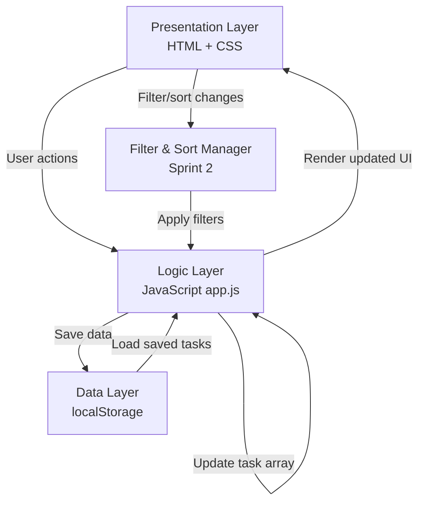
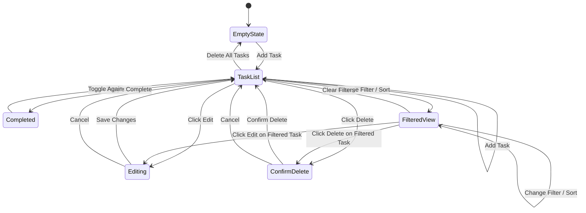

# StudyFlow2---Sprint-2

# StudyFlow - System Design Document

**A mobile-first personal task planner designed for university students**

**Student:** Shreyas Jaiswal  
**Module:** Software Development 2 (5FTC1322 / 5FTC1323)  
**Date:** April 2026 (Sprint 2 Update)

---

## Table of Contents

1. [User & System Requirements](#1-user--system-requirements)
2. [Product Backlog](#2-product-backlog)
3. [Design & Development Documentation](#3-design--development-documentation)
4. [Project Management](#4-project-management)
5. [Software Tools & Techniques](#5-software-tools--techniques)
6. [Completion & Testing](#6-completion--testing)

---


# 1. User & System Requirements

## 1.1 User Requirements (User Stories)

User stories are prioritised using the **MoSCoW method**:

- **Must Have (M)** - Essential for the app to function; without these, the product has no value.
- **Should Have (S)** - Important features that add significant value but are not critical for launch.
- **Could Have (C)** - Nice-to-have features that improve the experience but can be deferred.
- **Won't Have (W)** - Out of scope for this version but considered for future development.

### Must Have

| ID | User Story | Priority |
|----|-----------|----------|
| US-01 | As a student, I want to create a task with a title and deadline, so that I can record upcoming coursework in one place. | Must |
| US-02 | As a student, I want to assign a priority level (Low, Medium, High) to each task, so that I can focus on the most urgent work first. | Must |
| US-03 | As a student, I want to tag each task with a module name, so that I can organise my workload by subject. | Must |
| US-04 | As a student, I want to mark a task as complete, so that I can track my progress and see what I have finished. | Must |
| US-05 | As a student, I want to view all my tasks for today, so that I can see what needs my attention right now. | Must |
| US-06 | As a student, I want to edit an existing task, so that I can update details if a deadline or priority changes. | Must |
| US-07 | As a student, I want to delete a task, so that I can remove items that are no longer relevant. | Must |

### Should Have

| ID | User Story | Priority |
|----|-----------|----------|
| US-08 | As a student, I want to view my tasks for the current week, so that I can plan ahead and manage my time across multiple days. | Should |
| US-09 | As a student, I want to receive a reminder notification before a deadline, so that I do not forget about upcoming submissions. | Should |
| US-10 | As a student, I want to filter my task list by module, so that I can focus on one subject at a time when studying. | Should |
| US-11 | As a student, I want to filter my task list by priority level, so that I can quickly find my most urgent tasks. | Should |

### Could Have

| ID | User Story | Priority |
|----|-----------|----------|
| US-12 | As a student, I want to see a progress summary (e.g. tasks completed vs. remaining), so that I feel motivated and can gauge how much work is left. | Could |
| US-13 | As a student, I want to sort tasks by deadline or priority, so that I can view my workload in the order that suits me best. | Could |
| US-14 | As a student, I want my tasks to be saved when I close the browser, so that I do not lose my data between sessions. | Could |
| US-15 | As a student, I want a colour-coded visual indicator for priority levels, so that I can scan my task list quickly at a glance. | Could |

### Won't Have (This Version)

| ID | User Story | Priority |
|----|-----------|----------|
| US-16 | As a student, I want to sync my tasks across multiple devices, so that I can access them from my phone and laptop. | Won't |
| US-17 | As a student, I want to share tasks or deadlines with classmates, so that we can coordinate on group work. | Won't |
| US-18 | As a student, I want to import deadlines from my university timetable automatically, so that I do not have to enter them manually. | Won't |

---

## 1.2 System Requirements

System requirements define what the application must do technically to support the user stories above.

### Functional System Requirements

| ID | Requirement | Related User Stories |
|----|------------|---------------------|
| SR-01 | The system shall allow the user to create, read, update, and delete (CRUD) tasks. Each task must store: title (text), deadline (date), priority level (Low/Medium/High), module name (text), and completion status (boolean). | US-01, US-02, US-03, US-04, US-06, US-07 |
| SR-02 | The system shall display tasks in a daily view, showing only tasks with deadlines matching the current date. | US-05 |
| SR-03 | The system shall display tasks in a weekly view, showing tasks with deadlines falling within the current Monday-Sunday period. | US-08 |
| SR-04 | The system shall allow the user to filter tasks by module name and/or priority level. | US-10, US-11 |
| SR-05 | The system shall provide visual distinction between priority levels using colour coding (e.g. green for Low, amber for Medium, red for High). | US-15 |
| SR-06 | The system shall trigger a browser notification or on-screen alert before a task's deadline (e.g. 24 hours or 1 hour before). | US-09 |
| SR-07 | The system shall persist task data using browser localStorage, so that data is retained between sessions without requiring a backend server. | US-14 |
| SR-08 | The system shall display a progress summary showing the number of tasks completed and tasks remaining. | US-12 |

### Non-Functional System Requirements

| ID | Requirement | Category |
|----|------------|----------|
| NFR-01 | The application shall be built using HTML, CSS, and JavaScript with no backend server required. | Technology |
| NFR-02 | The application shall be responsive and optimised for mobile screen sizes (360px-428px width) as the primary viewport, while remaining usable on desktop. | Usability |
| NFR-03 | The application shall load within 3 seconds on a standard mobile connection. | Performance |
| NFR-04 | The user interface shall follow a minimalist design with a calm colour palette (blues and neutrals) to reduce cognitive load. | Usability |
| NFR-05 | The application shall use clear, legible typography with a minimum font size of 16px for body text to ensure readability on small screens. | Accessibility |
| NFR-06 | All interactive elements (buttons, inputs) shall have a minimum tap target size of 44x44px to meet mobile accessibility standards. | Accessibility |
| NFR-07 | The system shall validate user input (e.g. prevent empty task titles, ensure deadlines are not in the past) and display clear error messages. | Robustness |
| NFR-08 | The codebase shall be modular, with separate files or clearly separated sections for HTML structure, CSS styling, and JavaScript logic. | Maintainability |

---


# 2. Product Backlog

## Sprint Overview

| Sprint | Duration | Focus | Goal |
|--------|----------|-------|------|
| Sprint 1 | 10-20 Mar 2026 | Core functionality | Deliver a fully working task manager with CRUD operations, priority levels, module tagging, completion tracking, and mobile-first responsive design. |
| **Sprint 2** | **1-25 Apr 2026** | **Enhanced filtering & UX** | **Extend the prototype with view filters (today/week), module and priority filtering, progress summary, and task sorting. All Sprint 1 functionality remains intact.** |

**Estimation Scale (Story Points):**

- 1 = Trivial (under 1 hour)
- 2 = Small (1-2 hours)
- 3 = Medium (2-4 hours)
- 5 = Large (4-8 hours)
- 8 = Complex (8+ hours)

---

## Sprint 1 - Core Functionality (Completed)

### BL-01: Project setup and HTML structure

- **Related Stories:** NFR-01, NFR-08
- **Description:** Set up the project folder structure with separate HTML, CSS, and JS files. Create the base HTML page with semantic structure including a header, main content area, task list container, and a form area for adding tasks.
- **Acceptance Criteria:**
  - [x] Project contains `index.html`, `style.css`, and `app.js` as separate files
  - [x] HTML uses semantic elements (`header`, `main`, `section`, `form`)
  - [x] Page loads in a browser without errors
  - [x] Basic layout structure is visible (header, content area, empty task list)
- **Story Points:** 2 - **COMPLETE**

---

### BL-02: Task creation form

- **Related Stories:** US-01, US-02, US-03, SR-01
- **Description:** Build a form that allows the user to create a new task by entering a title, selecting a deadline, choosing a priority level, and entering a module name.
- **Acceptance Criteria:**
  - [x] Form includes fields for: title, deadline, priority (Low/Medium/High dropdown), and module name
  - [x] Clicking **Add Task** creates a new task and displays it in the task list
  - [x] The form clears after successful submission
  - [x] Each task is stored as a JavaScript object with properties: `id`, `title`, `deadline`, `priority`, `module`, `completed`
- **Story Points:** 3 - **COMPLETE**

---

### BL-03: Input validation

- **Related Stories:** NFR-07
- **Description:** Add validation to the task creation form to prevent invalid or incomplete data from being submitted.
- **Acceptance Criteria:**
  - [x] The form does not submit if the title field is empty
  - [x] The form does not submit if no deadline is selected
  - [x] The form does not accept a deadline date in the past
  - [x] An error message is displayed next to the relevant field when validation fails
  - [x] Error messages disappear once the user corrects the input
- **Story Points:** 2 - **COMPLETE**

---

### BL-04: Task list display

- **Related Stories:** US-05, SR-02, SR-05
- **Description:** Display all tasks in a card layout. Each card shows the title, deadline, module name, and priority level with colour coding.
- **Acceptance Criteria:**
  - [x] All tasks currently in the array are rendered on the page
  - [x] Each task card displays: title, deadline (formatted), module name, and priority level
  - [x] Priority levels are colour-coded: green (Low), amber (Medium), red (High)
  - [x] Completed tasks are visually distinct (strikethrough + faded appearance)
  - [x] The task list updates immediately when a new task is added
- **Story Points:** 3 - **COMPLETE**

---

### BL-05: Mark task as complete

- **Related Stories:** US-04, SR-01
- **Description:** Add a checkbox to each task card that allows the user to toggle the task's completion status.
- **Acceptance Criteria:**
  - [x] Each task has a clickable checkbox
  - [x] Clicking the checkbox toggles the task's completed status
  - [x] Completed tasks show a visual change (strikethrough, greyed out)
  - [x] The user can un-complete a task by clicking the checkbox again
- **Story Points:** 2 - **COMPLETE**

---

### BL-06: Edit task

- **Related Stories:** US-06, SR-01
- **Description:** Allow the user to edit an existing task's details using the same form, pre-filled with current values.
- **Acceptance Criteria:**
  - [x] Each task has an **Edit** button
  - [x] Clicking **Edit** opens the task's details in the form pre-filled with current values
  - [x] The user can change any field and save
  - [x] The updated task is immediately reflected in the task list
  - [x] Cancelling an edit does not change the task
- **Story Points:** 3 - **COMPLETE**

---

### BL-07: Delete task

- **Related Stories:** US-07, SR-01
- **Description:** Allow the user to delete a task from the list with a confirmation step.
- **Acceptance Criteria:**
  - [x] Each task has a **Delete** button
  - [x] Clicking **Delete** shows a confirmation prompt
  - [x] Confirming the prompt removes the task from the list
  - [x] The task list re-renders immediately after deletion
  - [x] Cancelling the prompt keeps the task unchanged
- **Story Points:** 2 - **COMPLETE**

---

### BL-08: Mobile-first responsive CSS

- **Related Stories:** NFR-02, NFR-04, NFR-05, NFR-06
- **Description:** Style the application with a mobile-first approach using a calm blue/neutral palette, with media queries for larger screens.
- **Acceptance Criteria:**
  - [x] The layout is designed for mobile viewports (360-428px) first
  - [x] Body text is a minimum of 16px
  - [x] All buttons and interactive elements have a minimum tap target of 44x44px
  - [x] Colour palette uses blues and neutrals
  - [x] A media query adjusts the layout for desktop screens (768px+)
  - [x] No horizontal scrolling on mobile viewports
- **Story Points:** 5 - **COMPLETE**

**Sprint 1 Total: 22 story points - ALL COMPLETE**

---

## [S2] Sprint 2 - Enhanced Filtering & UX (NEW)

> **Sprint 2 additions are highlighted throughout this document. New backlog items, development entries, meeting notes, and test cases all begin with `[S2]` to distinguish Sprint 2 content from Sprint 1.**

### [S2] BL-09: Daily and weekly view filter

- **Related Stories:** US-05, US-08, SR-02, SR-03
- **Description:** Add a filter bar above the task list allowing the user to toggle between three views: **All** (show all tasks), **Today** (show only tasks with a deadline matching today's date), and **This Week** (show tasks due within the current Monday-Sunday period). The filter bar is always visible and the active view is highlighted.
- **Acceptance Criteria:**
  - [x] A filter bar is displayed above the task list with three options: **All**, **Today**, **This Week**
  - [x] Selecting **Today** shows only tasks with `deadline === todayString`
  - [x] Selecting **This Week** shows only tasks with deadlines falling within the current calendar week (Mon-Sun)
  - [x] Selecting **All** removes the view filter and shows all tasks
  - [x] The active filter is visually highlighted
  - [x] The task count badge updates to reflect the filtered result
  - [x] The empty state message updates to indicate no tasks match the current filter (e.g. *No tasks due today*)
- **Story Points:** 3 - **COMPLETE (Sprint 2)**

---

### [S2] BL-11: Filter by module and priority

- **Related Stories:** US-10, US-11, SR-04
- **Description:** Add module and priority filter controls to the filter bar. The module filter is a text search that matches task module names. The priority filter is a set of toggle buttons (All, High, Medium, Low). Filters stack with the view filter (BL-09), e.g. a user can show only High priority tasks due this week.
- **Acceptance Criteria:**
  - [x] A priority filter is displayed with options: **All**, **High**, **Medium**, **Low**
  - [x] Selecting a priority shows only tasks with that priority level; selecting **All** removes the priority filter
  - [x] A module search input filters tasks whose module field contains the entered text (case-insensitive)
  - [x] All filters (view, priority, module) work in combination
  - [x] A **Clear Filters** button resets all filters to their default state
  - [x] The active priority filter button is visually highlighted
- **Story Points:** 3 - **COMPLETE (Sprint 2)**

---

### [S2] BL-12: Sort tasks by deadline or priority

- **Related Stories:** US-13
- **Description:** Formalise the task sorting behaviour. Tasks are sorted automatically: incomplete tasks appear above completed ones. Within incomplete tasks, overdue tasks appear first (most urgent), then by deadline ascending. Priority is used as a secondary sort within the same deadline. A sort control allows the user to switch between **Deadline** and **Priority** sort order.
- **Acceptance Criteria:**
  - [x] Completed tasks are always sorted to the bottom of the list
  - [x] Overdue tasks appear at the top of the incomplete section
  - [x] Within incomplete tasks, a **Sort by** control allows switching between deadline order and priority order
  - [x] Priority order is: High -> Medium -> Low
  - [x] The selected sort order is visually indicated
  - [x] Sorting persists across filter changes within a session
- **Story Points:** 2 - **COMPLETE (Sprint 2)**

---

### [S2] BL-15: Progress summary

- **Related Stories:** US-12, SR-08
- **Description:** Display a real-time progress summary in the header showing total tasks, active tasks, completed tasks, and a percentage progress bar. The progress bar animates when updated and glows when 100% is reached.
- **Acceptance Criteria:**
  - [x] Header displays: **Total**, **Active**, and **Done** counts
  - [x] A progress bar shows the percentage of tasks completed
  - [x] The bar width animates smoothly when tasks are added, completed, or deleted
  - [x] When all tasks are complete, the bar glows green and the label reads *All tasks completed!*
  - [x] When no tasks exist, the label reads *No tasks yet*
  - [x] Stats update immediately on any task change
- **Story Points:** 2 - **COMPLETE (Sprint 2)**

**Sprint 2 Total: 10 story points - ALL COMPLETE**

---

## Remaining Future Backlog

The following items were not implemented in Sprint 1 or Sprint 2. They remain documented for future development cycles.

| ID | Feature | Related Stories | Story Points | Rationale for Deferral |
|----|---------|----------------|-------------|----------------------|
| BL-10 | Extended weekly view (Mon-Sun grid layout) | US-08, SR-03 | 3 | The This Week filter (BL-09) addresses the core use case; a calendar grid layout adds complexity without core value |
| BL-13 | localStorage persistence | US-14, SR-07 | 3 | **Completed during Sprint 1** (implemented within BL-02) |
| BL-14 | Reminder notifications | US-09, SR-06 | 5 | Technically complex (browser Notification API requires HTTPS and user permission); deferred |

---

# 3. Design & Development Documentation

## 3.1 Overall Design & Architecture

StudyFlow follows a **three-layer architecture** that separates concerns between presentation, logic, and data.

### Presentation Layer (HTML / CSS)

Handles the user interface. A single HTML page (`index.html`) is styled by an external stylesheet (`style.css`). The page is divided into three main areas:

- Header with progress stats
- Task form section
- Task list section

Sprint 2 adds a filter bar between the form section and the task list.

### Logic Layer (JavaScript)

All application behaviour is handled by a single JavaScript file (`app.js`). This layer contains five logical modules:

- **Task Manager** - handles all CRUD operations on the task array
- **Validation** - checks user input before a task is created or updated
- **Renderer** - updates the DOM whenever task data or filter state changes
- **Utilities** - helper functions for date formatting, ID generation, and overdue detection
- **[S2] Filter & Sort Manager** - manages the active view filter, priority filter, module search, and sort order; applies all active filters before passing tasks to the renderer

### Data Layer (Browser localStorage)

Tasks are stored as a JSON array in `localStorage`.

Filter state is not persisted. It resets on page load. This is an intentional design decision because each session should begin with the full task list, avoiding confusion from old filters still being active.

### File Structure

```text
StudyFlow/
|-- index.html      - Page structure and content (updated Sprint 2)
|-- style.css       - All styling and responsive design (updated Sprint 2)
|-- app.js          - Application logic and behaviour (updated Sprint 2)
|-- README.md       - Project documentation (this file)
```

### Data Flow

1. The user interacts with the UI, such as clicking **Add Task** or changing a filter.
2. A DOM event triggers a JavaScript function in the logic layer.
3. For task changes, the function validates input and updates the task array.
4. The updated task array is saved to `localStorage`.
5. For filter changes, the `filterState` object is updated.
6. The renderer applies active filters and sort order.
7. The filtered and sorted task list is re-drawn on the page.

### Architecture Diagram



### Architecture Evaluation

Sprint 2 improves the architecture by separating **task data** from **view state**.

| Concern | Stored In | Purpose |
|--------|-----------|---------|
| Task data | `tasks` array + `localStorage` | Permanent user-created task records |
| View state | `filterState` object | Temporary UI filtering and sorting choices |
| Rendered output | DOM | Current visible result after filtering and sorting |

This separation is important because filters should not modify the original task data. They only transform how the data is displayed. This reduces the risk of accidental data loss and makes the filtering logic easier to test.

---

## 3.2 Development Strategy

StudyFlow is developed using an **iterative, sprint-based approach**. Sprint 1 delivered the core CRUD functionality. Sprint 2 extends the prototype with filtering, sorting, and progress tracking without modifying or breaking any Sprint 1 functionality.

### Sprint 2 Development Order

1. **Progress summary (BL-15)** - implemented first because the header stats and progress bar structure already existed in the HTML from Sprint 1; this only required completing the JavaScript `updateStats()` function.
2. **Sort control (BL-12)** - formalised the sort logic already in the renderer and added a sort toggle UI above the task list.
3. **View filter (BL-09)** - added the filter bar with All / Today / This Week buttons; introduced the `filterState` object to the logic layer.
4. **Module and priority filter (BL-11)** - extended `filterState` to include priority and module search; all three filters are applied together in a single `getFilteredTasks()` function before rendering.

This order minimised risk. Each feature was added and tested before the next began. The filter state approach was chosen over multiple separate filter functions to keep the renderer simple. The renderer always calls `getFilteredTasks()` regardless of what changed.

### [S2] Sprint 2 Highlighted Code Changes

All Sprint 2 additions to the codebase are marked with a `// [SPRINT 2]` comment in `app.js` and a corresponding CSS block label in `style.css` for traceability.

**New in `index.html` (Sprint 2):**

- Filter bar section added above the task list
- View toggle buttons: **All**, **Today**, **This Week**
- Priority filter buttons: **All**, **High**, **Medium**, **Low**
- Module search input
- **Clear Filters** button
- Sort control inside the task section header

**New in `app.js` (Sprint 2):**

- `filterState` object - stores active view (`all` / `today` / `week`), active priority (`all` / `High` / `Medium` / `Low`), and module search text
- `getWeekRange()` - calculates the Monday and Sunday of the current week for the This Week filter
- `getFilteredTasks()` - applies all active filters sequentially to the tasks array
- `sortTasks()` - sorts filtered tasks by the active sort mode (deadline or priority)
- `updateFilterUI()` - syncs the active visual state of filter buttons with the current filter state
- `setupFilterListeners()` - attaches all event listeners for the filter bar controls
- Extended `renderTasks()` to call `getFilteredTasks()` and `sortTasks()` before rendering

**New in `style.css` (Sprint 2):**

- `.filter-bar` - container for all filter controls
- `.filter-group` - label and control row layout
- `.filter-btn` - individual filter toggle button
- `.filter-btn--active` - highlighted state for the active filter
- `.filter-input` - module search input styling
- `.sort-control` - sort selector above the task list

### Development Strategy Evaluation

| Strength | Explanation |
|---------|-------------|
| Low-risk iteration | Each feature was completed and tested before the next was started. |
| Clear traceability | Each change maps to a backlog item and acceptance criteria. |
| Maintainability | Sprint 2 functionality was added through new filter/sort functions rather than rewriting the full renderer. |
| Controlled scope | Notification features were deferred because browser permissions and HTTPS requirements would introduce complexity beyond the sprint scope. |

---

## 3.3 Technology Stack

### Core Technologies

| Technology | Role | Justification |
|-----------|------|---------------|
| HTML5 | Page structure | Semantic elements improve accessibility. Native form elements reduce the need for custom components. |
| CSS3 | Styling & layout | Flexbox and media queries enable a responsive, mobile-first layout without any CSS frameworks. |
| JavaScript (ES6+) | Application logic | Handles all interactivity, data management, DOM manipulation, filtering, and sorting. No framework is needed for this scope. |
| Browser localStorage | Data persistence | Stores tasks as a JSON string between sessions. Suitable for a single-user, client-side application. |

### Why No Framework?

A framework like React or Vue would add unnecessary complexity for an application of this size. Vanilla JavaScript provides full control over the DOM without the overhead of a build system or framework-specific syntax. This also means the app can be opened directly in a browser from the file system with no server or build step required.

### Technology Trade-Offs

| Decision | Benefit | Limitation |
|---------|---------|------------|
| Vanilla JavaScript | Lightweight, transparent, no dependencies | More manual DOM handling |
| localStorage | Simple persistence, no backend required | Data is tied to one browser/device |
| Single-page app | Fast, simple user flow | Limited scalability for multi-user features |
| Manual testing | Easy to conduct and document | Less reliable than automated regression tests |

---

## 3.4 User Interface Design

### Design Principles

1. **Minimalist layout** - reduce cognitive load by showing only essential information.
2. **Calm colour palette** - blues and neutral tones; high-contrast colours reserved for priority indicators.
3. **Clear typography** - minimum font size of 16px for body text.
4. **Accessible touch targets** - all buttons and interactive elements have a minimum size of 44x44px.

### [S2] Sprint 2 UI Additions

**Filter Bar** - positioned between the form section and the task list. It contains:

- **View** toggle row: `All | Today | This Week`
- **Priority** filter row: `All | High | Medium | Low`
- **Module** text search input
- **Clear Filters** button

**Sort Control** - a compact `Sort by: Deadline | Priority` control inside the task section header. This allows the user to change task ordering without affecting the active filters.

The filter bar uses the same design tokens as the rest of the app:

- Colour variables
- Border radius
- Font size
- Button spacing
- Active state styling

### Colour Palette

| Colour | Hex Code | Usage |
|--------|----------|-------|
| Dark Blue | `#1A3A5C` | Header background, primary buttons |
| Medium Blue | `#2E6B9E` | Active states, links, active filter buttons |
| Light Blue | `#E8F0FE` | Card backgrounds, subtle highlights |
| White | `#FFFFFF` | Page background |
| Light Grey | `#F0F2F5` | Section backgrounds |
| Dark Grey | `#333333` | Body text |
| Red | `#D9534F` | High priority indicator |
| Amber | `#F0AD4E` | Medium priority indicator |
| Green | `#5CB85C` | Low priority indicator, completed tasks |

### Responsive Design Approach

- Base styles target mobile screens (360-428px width)
- Media query at 768px switches to a two-column grid layout
- Sprint 2 filter controls use wrapping/scroll-safe layouts to avoid breaking on narrow mobile screens
- Buttons retain at least 44x44px tap targets

### UI Design Evaluation

| Design Decision | Benefit | Trade-Off |
|----------------|---------|-----------|
| Inline task form | Simple and mobile-friendly | Takes vertical space on small screens |
| Filter bar above task list | Easy to find and use | Adds visual density |
| Module text search | Flexible and quick | Users can type inconsistent module names |
| Priority buttons | Faster than dropdown interaction | Takes more horizontal space |
| Progress bar in header | Immediate feedback | Could distract if over-animated |

---

## 3.5 State Diagram

### [S2] Updated Application States (Sprint 2)

The Sprint 2 filter state is separate from the task interaction states. The user can change filters at any time regardless of whether they are in Add or Edit mode.



### State Diagram Evaluation

The diagram shows that filtering is a **view transformation**, not a destructive data operation. This means:

- The task array remains unchanged.
- Only the visible task list changes.
- Edit and delete still work on filtered tasks because every task keeps its unique ID.

---

## 3.6 Technical Challenges

| Challenge | Description | Solution |
|-----------|-------------|----------|
| Unique task IDs | Each task needs a unique identifier for edit and delete operations. | Generate a unique ID using `Date.now().toString(36)` combined with a random suffix. |
| Date handling | JavaScript Date objects can behave inconsistently across browsers and time zones. | Store deadlines as `YYYY-MM-DD` strings and compare as strings for filtering, avoiding time zone issues. |
| Form reuse for add and edit | The same form is used for creating and editing tasks. | Use a flag variable (`editingTaskId = null`). Null = create; an ID value = update. Reset after each submission. |
| [S2] Stacking multiple filters | Applying view, priority, and module filters simultaneously without losing track of which filters are active. | A single `filterState` object holds all active filter values. `getFilteredTasks()` applies them sequentially in one pass, keeping the logic readable and testable. |
| [S2] Empty state with filters active | When filters return no results, the empty state message should explain why rather than showing a generic message. | The renderer passes the active filter context to the empty state renderer, which selects an appropriate message string. |
| [S2] Week boundary calculation | Determining the start (Monday) and end (Sunday) of the current week reliably, including month/year boundaries. | `getWeekRange()` calculates Monday by subtracting `(dayOfWeek + 6) % 7` days from today, then adds 6 for Sunday, using `YYYY-MM-DD` string comparisons. |

### Technical Evaluation

The most important Sprint 2 technical improvement is the **filter pipeline**:

```text
Original tasks array
        ↓
View filter (All / Today / This Week)
        ↓
Priority filter
        ↓
Module search filter
        ↓
Sort order
        ↓
Rendered task cards
```

This pipeline is maintainable because each transformation has a clear purpose. It also supports future expansion, such as adding a completed/incomplete filter or module dropdown.

---

## 3.7 Test Plan

Testing is conducted manually by working through each backlog item's acceptance criteria. Each criterion is treated as an individual test case.

### Test Log Structure

| Column | Description |
|--------|-------------|
| Test ID | Unique identifier |
| Related Backlog Item | Which BL item is being tested |
| Test Description | What is being tested |
| Steps to Reproduce | Exact steps to perform the test |
| Expected Result | What should happen |
| Actual Result | What actually happened |
| Status | Pass / Fail |
| Notes | Observations, bugs found, or fixes applied |

### [S2] Sprint 2 Test Cases

#### BL-09: Daily and Weekly View Filter

| Test ID | Test Description | Steps | Expected Result |
|---------|------------------|-------|-----------------|
| T-23 | Today filter shows only today's tasks | Add a task with today's deadline and one with a future deadline. Click **Today**. | Only the task due today is visible. Task count badge updates. |
| T-24 | This Week filter shows tasks in current week | Add tasks for today, a day this week, and next month. Click **This Week**. | Only tasks within the current Mon-Sun window are shown. |
| T-25 | All filter restores full list | Apply Today filter, then click **All**. | All tasks are visible again. |
| T-26 | Empty state message reflects active filter | Apply Today filter with no tasks due today. | Empty state shows *No tasks due today* rather than the default message. |
| T-27 | Active filter button is highlighted | Click **This Week**. | This Week button is visually highlighted. All and Today buttons are not. |

#### BL-11: Filter by Module and Priority

| Test ID | Test Description | Steps | Expected Result |
|---------|------------------|-------|-----------------|
| T-28 | Priority filter shows correct tasks | Create tasks with High, Medium, Low priority. Click **High**. | Only High priority tasks are shown. |
| T-29 | Module search filters by text | Create tasks with modules `Networking` and `Mathematics`. Type `net` in the module search. | Only the Networking task is shown (case-insensitive match). |
| T-30 | Combined filters stack correctly | Apply This Week view filter and High priority filter. | Only High priority tasks due this week are shown. |
| T-31 | Clear Filters resets all filters | Apply multiple filters. Click **Clear Filters**. | All filters reset; full task list is shown; all filter buttons return to unselected state. |
| T-32 | Module search clears on Clear Filters | Type in module search field. Click **Clear Filters**. | Module search input is cleared and all tasks are visible. |

#### BL-12: Sort by Deadline or Priority

| Test ID | Test Description | Steps | Expected Result |
|---------|------------------|-------|-----------------|
| T-33 | Default sort is by deadline | Add tasks with different deadlines. Check task order. | Tasks sorted by nearest deadline first; overdue tasks at top; completed tasks at bottom. |
| T-34 | Priority sort orders High -> Medium -> Low | Switch sort to **Priority**. | High priority tasks appear first, then Medium, then Low. Within same priority, deadline order is maintained. |
| T-35 | Sort persists across filter changes | Set sort to Priority. Apply a filter. | Sort order remains Priority after applying the filter. |

#### BL-15: Progress Summary

| Test ID | Test Description | Steps | Expected Result |
|---------|------------------|-------|-----------------|
| T-36 | Stats update when task is added | Add a task. | Total and Active counts each increase by 1. |
| T-37 | Stats update when task is completed | Mark a task as complete. | Done count increases; Active count decreases; progress bar updates. |
| T-38 | Progress bar shows correct percentage | Add 4 tasks, complete 2. | Progress bar shows 50%, label reads `50% complete (2/4)`. |
| T-39 | All tasks complete triggers glow | Complete all tasks. | Progress bar fills to 100% and glows. Label reads `All tasks completed!`. |
| T-40 | Empty state shows No tasks yet | Delete all tasks. | Stats show 0/0/0, progress bar is empty, label reads `No tasks yet`. |

---
